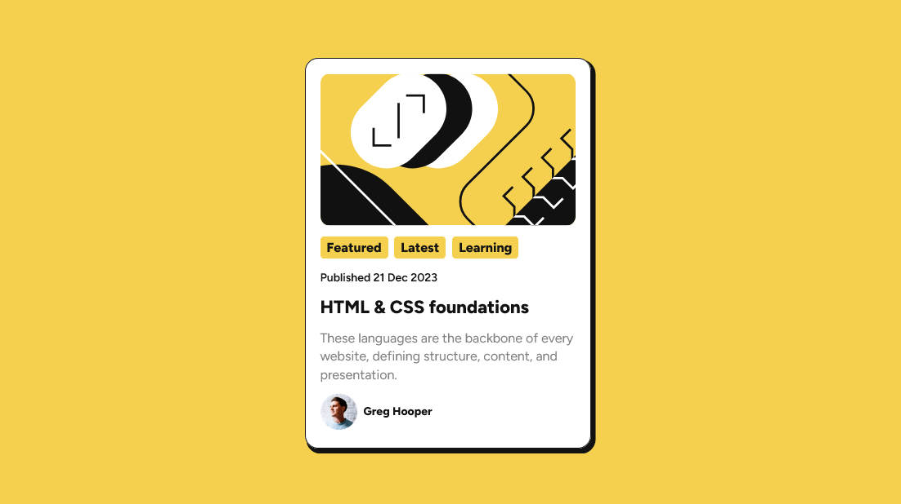

# Frontend Mentor - Blog preview card solution

This is a solution to the [Blog preview card challenge on Frontend Mentor](https://www.frontendmentor.io/challenges/blog-preview-card-ckPaj01IcS). Frontend Mentor challenges help you improve your coding skills by building realistic projects.

## Table of contents

-   [Overview](#overview)
    -   [The challenge](#the-challenge)
    -   [Screenshot](#screenshot)
    -   [Links](#links)
-   [My process](#my-process)
    -   [Built with](#built-with)
    -   [Liberties taken](#liberties-taken)
-   [Author](#author)

## Overview

### The challenge

The challenge is to build out a blog preview card and get it looking as close to the design as possible. Users should be able to see hover and focus states for all interactive elements on the page.

### Screenshot

### Links

-   Solution URL: [Blog Preview Card on Netlify](https://dashing-gaufre-e3ef0a.netlify.app/)

## My process

### Built with

-   Semantic HTML5 markup
-   CSS custom properties
-   CSS Grid
-   Mobile-first workflow

### Liberties taken

For this challenge, I added two sections to the solution:

-   A section with the feature / latest blog post
-   A second sections with past blog posts using a grid to display 3 cards on a desktop and stack them on mobile.

Obviously, with this additional section it is not going to match the Frontend Mentor design.

## Author

-   Frontend Mentor - [@davejnicol](https://www.frontendmentor.io/profile/davejnicol)
